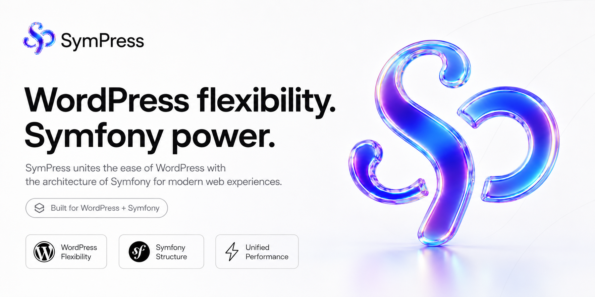

### SymPress

SymPress brings Symfony components into WordPress without turning WordPress into something unrecognizable. It keeps the publishing flexibility, plugin ecosystem, and runtime expectations of WordPress, then adds structured application patterns where they help: dependency injection, events, configuration, contracts, and testable packages.

## What SymPress Builds

- Symfony-powered building blocks for WordPress projects.
- Reusable packages that can be adopted one at a time.
- Clear contracts around WordPress hooks, configuration, and application services.
- A developer experience that feels familiar to Symfony and WordPress engineers.

## Principles

- WordPress remains the runtime.
- Symfony components provide structure where structure pays off.
- Packages should be small, composable, and documented.
- Integration should improve testability without hiding WordPress behavior.

## Contributing

SymPress is built as an open project. Bug reports, feature ideas, documentation improvements, and focused pull requests are welcome. Start with the issue templates when opening new work, and read the contribution guide before sending larger changes.

## Links

- :page_with_curl: [Contribution guide](../CONTRIBUTING.md)
- :lock: [Security policy](../SECURITY.md)
- :balance_scale: [License](../LICENSE)
